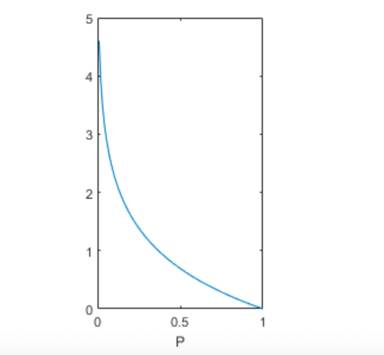
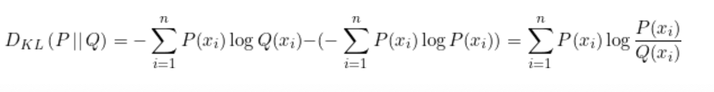
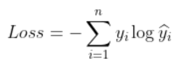

# 1.交叉熵损失
## 1.1 信息量
事件包含的信息与其发生的概率负相关。
假设X是一个离散随机变量，他的取值集合为{x1, x2,...,xn}，则定义时间X= xi的信息量为: 
I(xi) = -logP(X=xi)

## 1.2 信息熵
上述给出的信息量只能处理随机变量指定值的信息量，香浓熵来对整个概率分布的平均信息量进行描述，求信息量函数关于概率分布P的期望，期望值为熵。 
H(x) = -$\sum_1^n$P(X=xi)logP(X=xi)

接近确定性分布（输出几乎可以确定的）的具有较低的熵，接近均匀分布的具有较高的熵。

## 1.2 相对熵（KL散度）
衡量两个分布的差异 比如 X的真实分布为P(X),实际处理问题时用Q(X)来建模

P(X)对Q(X)的交叉熵 - P(x)的信息熵
两个性质： 
(1)散度是不对称的，DKL(P||Q) != DKL(P||Q)
(2)KL散度>=0,当且仅当P(x) == Q(x) 
计算例子: 
(1)多类别分类，单个样本 yi 真实分布，y_hati 网络输出

(2)二分类
Loss = -(ylogy_hat + (1-y)log1-y_hat)

