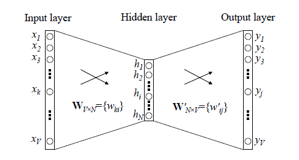

# 一、Word2vec基础介绍
本质：只具有一个隐含层的神经网络

训练方式：cbow + skip-gram

适应场景:cbow适合数据及比较小的情况，skip-gram适合大型语料库

## 1.1 CBOW
（1）使用上下文来预测中心单词  
（2）输入C个单词，分别和特征矩阵相乘，求平均作为隐向量

## 1.2 Skip-gram
（1）使用单词预测语境  
（2）超参 skip_window 窗口大小 ,num_skips 选取多少个不同的词作为output_word
例子："There is an apple on the table" skip_window = 2,output_word= 2,中心词 = apple
训练数据->('apple,an','apple,on')

## 1.3 技巧
### 1.3.1 hierarchical softmax
(1)原模型 输入*特征矩阵然后求平均，改进：直接对输入向量求和 如：输入（0，1，0，0），（0，0，1，0）--> (0,1,1,0)  
(2)采用哈夫曼树替换原先隐藏层到输出层的矩阵，哈夫曼的叶子节点代表为词汇表中的单词，根节点到该叶子结点的路径确定了这个单词的词向量。
通过hierarchical softmax把V分类变成log(V)次二分类问题
(3)选择左子树概率为1
### 1.3.1 Negative Sampling
动机： 
使用霍夫曼树来代替传统的神经网络，可以提高模型训练的效率。但是如果我们的训练样本里的中心词w是一个很生僻的词，那么就得在霍夫曼树中辛苦的向下走很久了；

做法： 
(1)随机选择一个较少数目的"负样本"来更新对应的权重，一种概率采样的方式，可以根据词频进行随机抽样，倾向于选择词频较大的负样本；

(2)NS是一种概率采样的方式，可以根据词频进行随机抽样，我们倾向于选择词频比较大的负样本，比如“的”，这种词语其实是对我们的目标单词没有很大贡献的。
Word2vec则在词频基础上取了0.75次幂，减小词频之间差异过大所带来的影响，使得词频比较小的负样本也有机会被采到。

(3)极大化正样本出现的概率，同时极小化负样本出现的概率，以sigmoid来代替softmax，相当于进行二分类，判断这个样本到底是不是正样本

好处： 
(1)用来提高训练速度并且改善所得到词向量的质量的一种方法；
(2)不同于原本每个训练样本更新所有的权重，负采样每次让一个训练样本仅仅更新一小部分的权重，这样就会降低梯度下降过程中的计算量。

# 二、Word2vec对比
## 2.1 word2vec和NNLM对比有什么区别？（word2vec vs NNLM）
NNLM：是神经网络语言模型，使用前 n - 1 个单词预测第 n 个单词;

word2vec ：使用第 n - 1 个单词预测第 n 个单词的神经网络模型。但是 word2vec 更专注于它的中间产物词向量，所以在计算上做了大量的优化。

优化如下：
对输入的词向量直接按列求和，再按列求平均。这样的话，输入的多个词向量就变成了一个词向量。
采用分层的 softmax(hierarchical softmax)，实质上是一棵哈夫曼树。
采用负采样，从所有的单词中采样出指定数量的单词，而不需要使用全部的单词
## 3.2 word2vec和tf-idf 在相似度计算时的区别？
- word2vec 是稠密的向量，而 tf-idf 则是稀疏的向量；
- word2vec 的向量维度一般远比 tf-idf 的向量维度小得多，故而在计算时更快；
- word2vec 的向量可以表达语义信息，但是 tf-idf 的向量不可以；
- word2vec 可以通过计算余弦相似度来得出两个向量的相似度，但是 tf-idf 不可以；
# 资料参考
- https://www.cnblogs.com/rossiXYZ/p/13427829.html
- https://cloud.tencent.com/developer/article/1794461
- https://blog.csdn.net/qq_22795223/article/details/105627375