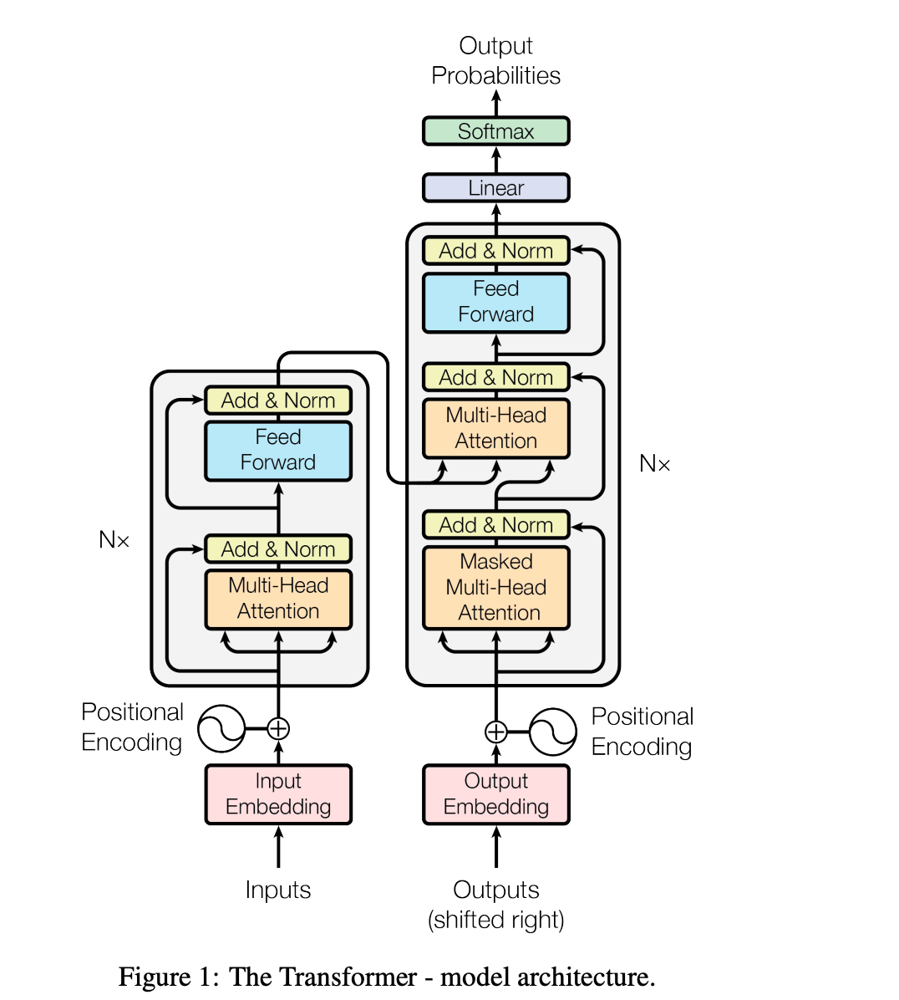
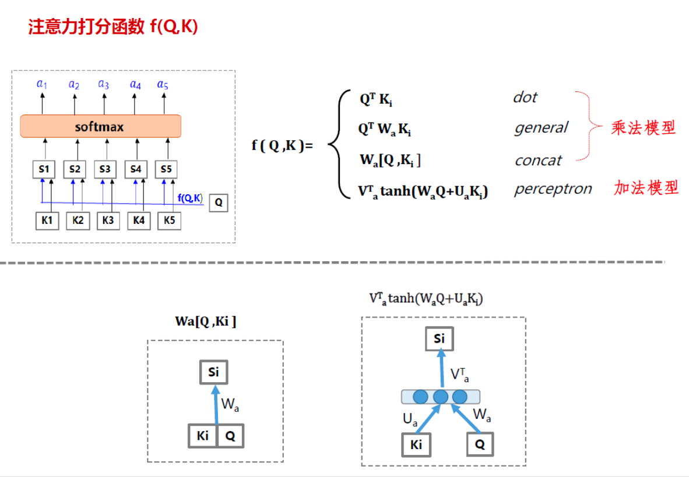
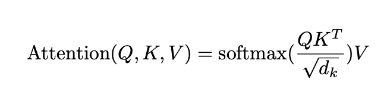
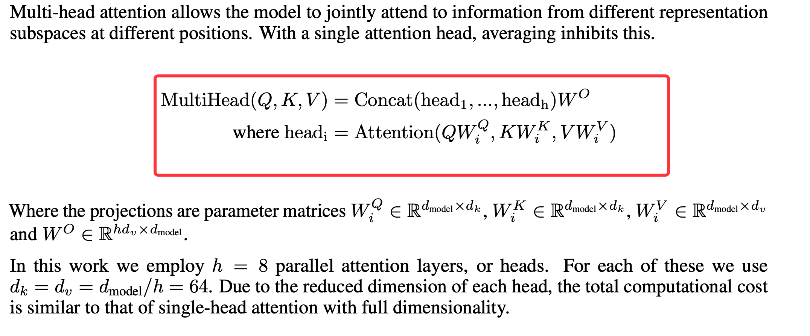
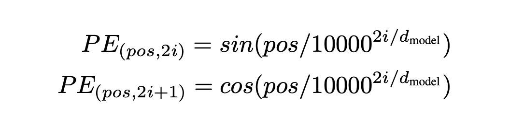
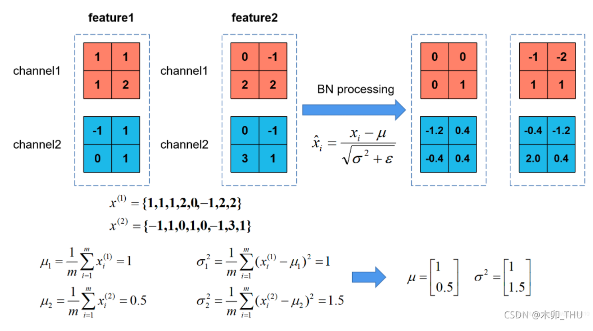

# 一、动机篇
## 1.1 为什么要有 Transformer?
Recurrent models 建模的时候沿着时序维度建模，每一步需要计算依赖前面的隐状态<br>
(1)时序计算难以并行化训练：<br>
The fundamental
constraint of sequential computation:This inherently sequential nature precludes parallelization within training examples, which becomes critical at longer
sequence lengths, as memory constraints limit batching across examples.(长序列内存限制，没办法并行化训练)<br>
(2)输入输出之间的长序列依赖问题：draw global dependencies between input and output，constant number of operations, albeit at the cost of reduced effective resolution due
to averaging attention-weighted positions ，CNN能够并行，无法捕获长距离依赖信息#todo
(3)传统 Attention
方法：基于源端和目标端的隐向量计算Attention，
结果：源端每个词与目标端每个词间的依赖关系 【源端->目标端】
问题：忽略了 远端或目标端 词与词间 的依赖关系


## 1.2 Transformer 作用是什么？
(1)more parallelizable and requiring significantly
less time to train
# 二、整体结构篇
## 2.1 Transformer 整体结构是怎么样？
(1)encoder-decoder
(2) dispensing with recurrence and convolutions
entirely.
(3)solely on attention mechanisms 


## 2.2 Transformer-encoder 结构怎么样？
## 2.3 Transformer-decoder 结构怎么样?
# 三、模块篇
## 3.1 self-attention 模块
### 3.1.1 传统 attention 是什么?
如果是常规的Target不等于Source情形下的注意力计算，其物理含义正如上文所讲，比如对于机器翻译来说，本质上是目标语单词和源语单词之间的一种单词对齐机制。

### 3.1.2 为什么 会有self-attention?
Source内部元素之间或者Target内部元素之间。
### 3.1.3 self-attention 的核心思想是什么?
Source内部元素之间或者Target内部元素之间。相关性 compatibility 兼容性
### 3.1.4 self-attention 的目的是什么?
很明显，引入Self Attention后会更容易捕获句子中长距离的相互依赖的特征，因为如果是RNN或者LSTM，需要依次序序列计算，对于远距离的相互依赖的特征，要经过若干时间步步骤的信息累积才能将两者联系起来，而距离越远，有效捕获的可能性越小。
但是Self Attention在计算过程中会直接将句子中任意两个单词的联系通过一个计算步骤直接联系起来，所以远距离依赖特征之间的距离被极大缩短，有利于有效地利用这些特征。
除此外，Self Attention对于增加计算的并行性也有直接帮助作用。这是为何Self Attention逐渐被广泛使用的主要原因。
### 3.1.5 self-attention 的怎么计算的?
缩放点积


### 3.1.6 self-attention 为什么Q和K使用不同的权重矩阵生成，为何不能使用同一个值进行自身的点乘？
因为Q、K、V的不同，可以保证在不同空间进行投影，增强了表达能力，提高了泛化能力。
### 3.1.7 为什么采用点积模型的 self-attention 而不采用加性模型？
复杂度相似的情况下，乘积通过优化矩阵算法，是的计算效率更高，空间效率更高
### 3.1.8 Transformer 中在计算 self-attention 时为什么要除以d_k?
softmax 小值区间加性Attention和dot的Attention值差不多，大值区间，加性的大得多，因为soft大值趋于稳定
### 3.1.9 self-attention 如何解决长距离依赖问题？
(1)cnn 局部时序 类似ngram
(2)rnn t变大，梯度消失或者梯度爆炸 
利用自注意力机制，生成不同权重的连接，处理边长的信息序列
位置编码
### 3.1.10 self-attention 如何并行化？
### 3.1.11 why self-attention ?
(1)the total computational complexity per layer 层计算复杂度
(2)Another is the amount of computation that can
be parallelized, as measured by the minimum number of sequential operations required. 通过最小时序操作数量来衡量
(3)The path lenghth between long-range dependencies in the network 模型中长时依赖之间的轨迹长度。比较任意输入和输出位置两点之间的最大路径长度。

## 3.2 multi-head attention 模块
### 3.2.1 multi-head attention 的思路是什么样?
### 3.2.2 multi-head attention 的步骤是什么样?
分别用不同的q,k,v做Attention

### 3.2.3 Transformer为何使用多头注意力机制？（为什么不使用一个头）
多个子空间
### 3.2.4 为什么在进行多头注意力的时候需要对每个head进行降维？

### 3.2.5 multi-head attention 代码介绍
```python
class MultiHeadAttention(nn.Module):

  def __init__(self, n_heads=8):
    super(MultiHeadAttention, self).__init__()
    # do not use more instance to implement multihead attention
    # it can be complete in one matrix
    self.n_heads = n_heads

    # we can't use bias because there is no bias term in formular
    self.W_Q = nn.Linear(d_model, d_k * n_heads, bias=False)
    self.W_K = nn.Linear(d_model, d_k * n_heads, bias=False)
    self.W_V = nn.Linear(d_model, d_v * n_heads, bias=False)
    self.fc = nn.Linear(d_v * n_heads, d_model, bias=False)
    self.layer_norm = nn.LayerNorm(d_model)

  def forward(self, input_Q, input_K, input_V, attn_mask):
    '''
    To make sure multihead attention can be used both in encoder and decoder, 
    we use Q, K, V respectively.
    input_Q: [batch, len_q, d_model]
    input_K: [batch, len_k, d_model]
    input_V: [batch, len_v, d_model]
    '''
    residual, batch = input_Q, input_Q.size(0)

    # [batch, len_q, d_model] -- matmul W_Q --> [batch, len_q, d_q * n_heads] -- view --> 
    # [batch, len_q, n_heads, d_k,] -- transpose --> [batch, n_heads, len_q, d_k]

    Q = self.W_Q(input_Q).view(batch, -1, n_heads, d_k).transpose(1, 2) # [batch, n_heads, len_q, d_k]
    K = self.W_K(input_K).view(batch, -1, n_heads, d_k).transpose(1, 2) # [batch, n_heads, len_k, d_k]
    V = self.W_V(input_V).view(batch, -1, n_heads, d_v).transpose(1, 2) # [batch, n_heads, len_v, d_v]

    attn_mask = attn_mask.unsqueeze(1).repeat(1, n_heads, 1, 1) # [batch, n_heads, seq_len, seq_len]

    # prob: [batch, n_heads, len_q, d_v] attn: [batch, n_heads, len_q, len_k]
    prob, attn = ScaledDotProductAttention()(Q, K, V, attn_mask)

    prob = prob.transpose(1, 2).contiguous() # [batch, len_q, n_heads, d_v]
    prob = prob.view(batch, -1, n_heads * d_v).contiguous() # [batch, len_q, n_heads * d_v]

    output = self.fc(prob) # [batch, len_q, d_model]

    return self.layer_norm(residual + output), attn
```
## 3.3 位置编码（Position encoding）模块
### 3.3.1 为什么要 加入 位置编码（Position encoding） ？
(1)Since our model contains no recurrence and no convolution, in order for the model to make use of the
order of the sequence, we must inject some information about the relative or absolute position of the
tokens in the sequence. 模型没有循环或卷积结构，为了让模型使用时序特征，需要插入一下相对或者绝对位置相关的Token信息
### 3.3.2 位置编码（Position encoding）的思路是什么 ？

That is, each dimension of the positional encoding
corresponds to a sinusoid. The wavelengths form a geometric progression from 2π to 10000 · 2π. We
chose this function because we hypothesized it would allow the model to easily learn to attend by
relative positions, since for any fixed offset k, PEpos+k can be represented as a linear function of
PEpos.
每一维度都是一个正弦函数，为什么选正弦函数，因为他能允许模型容易学会相对位置的表示，因为对于任意固定偏移量，PEpos+k都可以用PEpos线性表示。（正弦函数）<br>
位置编码也可以通过学习获得，但是正弦编码在训练中能兼容更大长度的输入。
### 3.3.3 位置编码（Position encoding）的作用是什么 ？
学习位置相关信息
### 3.3.4 位置编码（Position encoding）的步骤是什么 ？

### 3.3.5 Position encoding为什么选择相加而不是拼接呢？

### 3.3.6 Position encoding和 Position embedding的区别？
https://kexue.fm/archives/8130
绝对位置编码+相对位置编码
### 3.3.7 为何17年提出Transformer时采用的是 Position Encoder 而不是Position Embedding？而Bert却采用的是 Position Embedding ？
Transformer的位置编码是一个固定值，因此只能标记位置，但是不能标记这个位置有什么用。
BERT的位置编码是可学习的Embedding，因此不仅可以标记位置，还可以学习到这个位置有什么用。
BERT选择这么做的原因可能是，相比于Transformer，BERT训练所用的数据量充足，完全可以让模型自己学习。
但是BERT的位置有限，超过这个位置就不能处理  ->  https://kexue.fm/archives/7947 苏剑林位置分解
### 3.3.8 位置编码（Position encoding）的代码介绍
```python
class PositionalEncoding(nn.Module):

  def __init__(self, d_model, dropout=.1, max_len=1024):
    super(PositionalEncoding, self).__init__()
    self.dropout = nn.Dropout(p=p_drop)

    positional_encoding = torch.zeros(max_len, d_model) # [max_len, d_model]
    position = torch.arange(0, max_len).float().unsqueeze(1) # [max_len, 1]

    div_term = torch.exp(torch.arange(0, d_model, 2).float() * 
                         (-torch.log(torch.Tensor([10000])) / d_model)) # [max_len / 2]

    positional_encoding[:, 0::2] = torch.sin(position * div_term) # even
    positional_encoding[:, 1::2] = torch.cos(position * div_term) # odd

    # [max_len, d_model] -> [1, max_len, d_model] -> [max_len, 1, d_model]
    positional_encoding = positional_encoding.unsqueeze(0).transpose(0, 1)

    # register pe to buffer and require no grads
    self.register_buffer('pe', positional_encoding)

  def forward(self, x):
    # x: [seq_len, batch, d_model]
    # we can add positional encoding to x directly, and ignore other dimension
    x = x + self.pe[:x.size(0), ...]

    return self.dropout(x)
```
## 3.4 残差模块模块
### 3.4.1 为什么要 加入 残差模块？
一是解决梯度消失的问题，二是解决权重矩阵的退化问题 梯度消失，模型退化
## 3.5 Layer normalization 模块
### 3.5.1 为什么要 加入 Layer normalization 模块？

### 3.5.2 Layer normalization 模块的是什么？

### 3.5.3 Batch normalization 和 Layer normalization 的区别？
batch 各个 dim  沿着batch做归一
https://www.optgeo.top/ge-chong-normalizationde-ji-suan-fang-fa-2-ln.html

Layer Norm是沿特征维度对单个数据样本进行标准化。它的一个关键优点是不依赖于batch的大小，使其适用于小批量甚至单样本的场景。这种独立于batch大小的特性使Layer Norm成为处理变长序列和小批量数据的理想选择。
### 3.5.4 Transformer 中为什么要舍弃 Batch normalization 改用 Layer normalization 呢?
计算依赖性：BN依赖于整个mini-batch的数据，这与Transformer并行处理机制的需求相悖。
序列长度变化：Transformer通常处理不同长度的序列，BN难以适应这种变化，而Layer Norm则无此问题。
训练稳定性：Layer Norm在处理变长输入时显示出更好的稳定性，这对于提高模型的泛化能力至关重要。
内存效率：处理大规模数据时，Layer Norm的内存效率优于BN，这对于构建大型模型尤为重要。
### 3.5.5 Layer normalization 模块代码介绍
## 3.6 Mask 模块
### 3.6.1 什么是 Mask？
### 3.6.2 Transformer 中用到 几种 Mask？
### 3.6.3 能不能介绍一下 Transformer 中用到几种 Mask？
